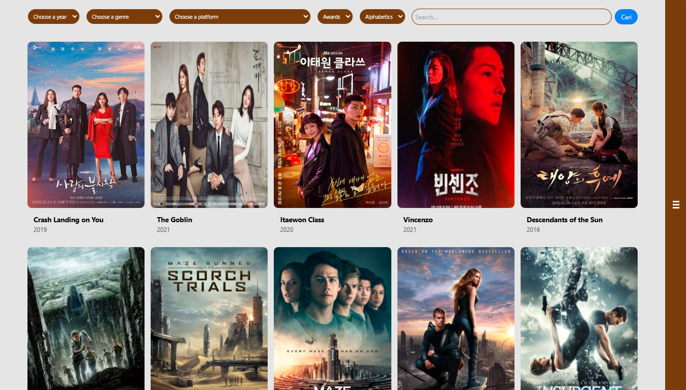
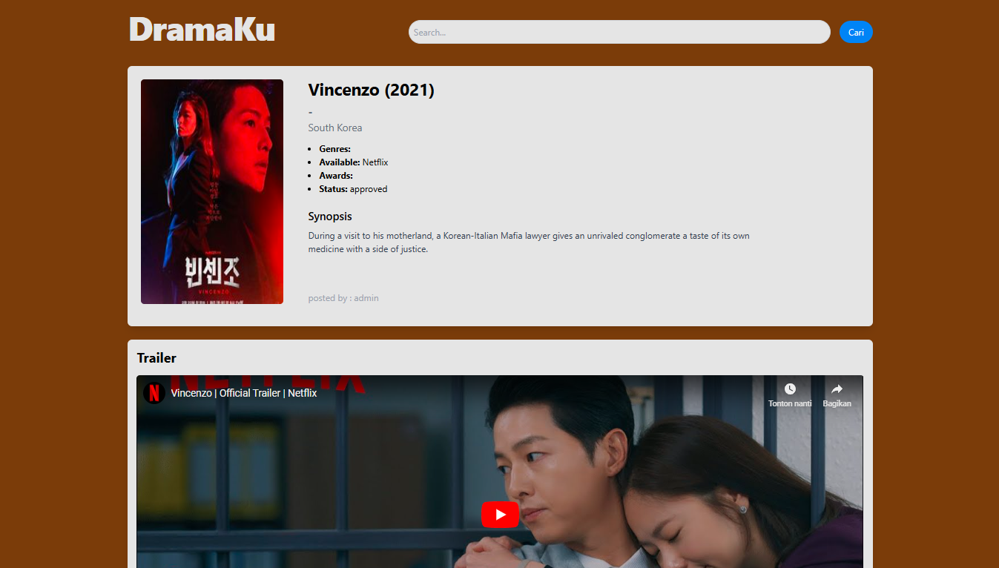
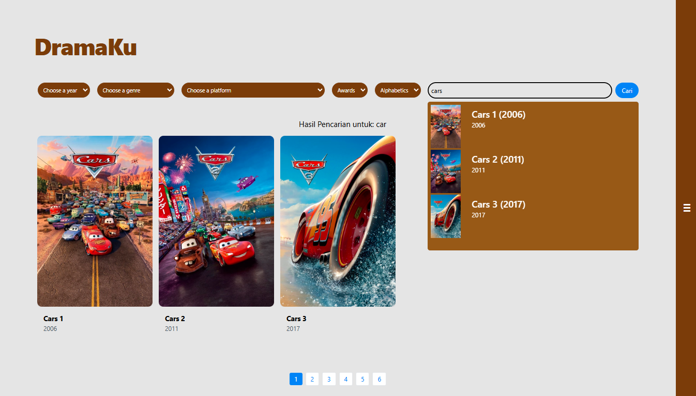

# **Website DramaKu** 

 |  |
|------------------------------------------|------------------------------------------|
|  |  |

Website ini dibuat untuk menyediakan informasi berbagai film yang ada. Informasi detail dari setiap film disertasi dengan rating dan komentar dari user.

---

## **Tech Stack**

**Client:** React, Vite, TailwindCSS

**Server:** PHP, Laravel 

---

## **Run Locally**

### **Set Up Front-End** 

#### **Clone Project Github**

Tentukan dimana anda akan menyimpan project, dan jalankan perintah berikut:

```bash
  git clone https://github.com/Ferdiahmad3404/web-film.git
```

#### **Pergi ke Directory Front-End**

```bash
  cd web-film/film-frontend
```

#### **Install Front-End Resource**
Jalankan perintah untuk menginstall semua Dependencies yang dibutuhkan oleh front-end

```bash
  npm install
```

### **Set Up Back-End** 

#### **Pergi ke Directory Back-End**

```bash
  cd ../film-backend
```

#### **Install Dependencies Pihak Ketiga**

Buka terminal dan jalankan perintah berikut:

```bash
  composer install
```

#### **Set Up Directory Upload File**

Jalankan perintah berikut dan set up directory upload file

```bash
  php artisan storage:link
```

#### **Buat File Conviguration `.env`**

Salin file `.env.example` untuk membuat file `.env`

```bash
  cp .env.example .env
```

Sesuaikan config database dengan database yang anda gunakan yang ada di dalam file `.env` anda

#### **Atur application key** 

Jalankan perintah untuk membuat application key berikut

```bash
  php artisan key:generate
```

#### **Atur JWT Key**

Jalankan perintah untuk membuat JWT key berikut

```bash
  php artisan jwt:secret
```

#### **Database Migration dan Seeding**

Jalankan perintah untuk membuat tabel dan mengisi data user serta comments 

```bash
  php artisan migrate
  php artisan db:seed
```

#### **Dataset**

Download setiap file csv dan jalankan setiap file python untuk memasukkan datanya ke database pada link berikut:

https://drive.google.com/drive/folders/1uBRGDFGFoq8SKYd-mdrb3KOBvmHrhjBx?usp=drive_link


---

## **Run Locally with Docker**

### **Set Up Front-End** 

#### **Pergi ke Directory Back-End**

Lorem Ipsum

```bash
  Lorem
```
    
### **Set Up Back-End** 

#### **Pergi ke Directory Back-End**

Lorem Ipsum

```bash
  ipsum
```


## **Installation Demo**

Insert gif or link to video
